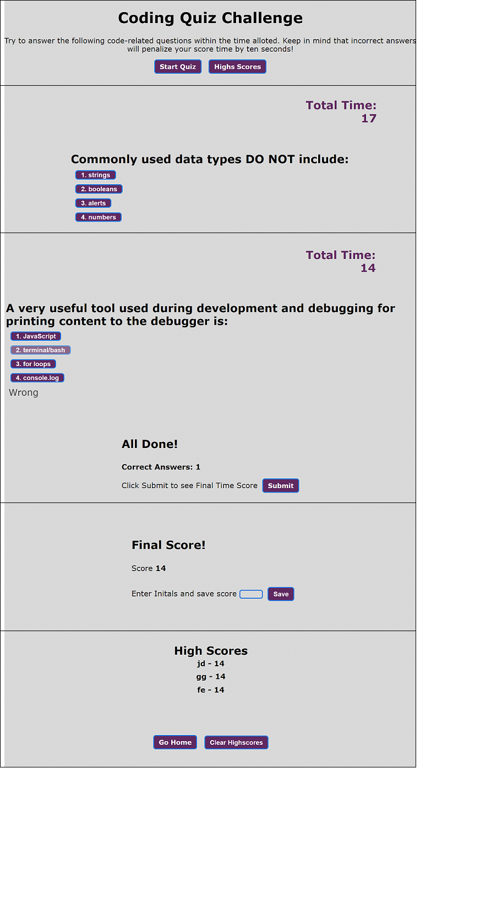

# code-quiz
A timed coding quiz with multiple-choice questions. 

## Description
This is primarily a javaScript project using arrays and local storage to generate questions and keep track of highscores. The users attempts to answer the code-related questions within the time
alloted. Incorrect answers will penalize the score time by ten seconds! <a href="https://jamillerooks.github.io/code-quiz/" target="_blank">Link to Coding Quiz website</a>
 

# Mock-up

# Contribution Guidelines
Your suggestions are welcome to help us achieve the goal of improved website accessibility and SEO ranking. 

We use Github and all it's built-in features to host the website, and to pull requests to the local repository.

Report all bugs to Github <a href="https://github.com/issues" target="_blank">issues</a> 

This website uses semantic HTML elements, and universal, element, and class selectors in CSS.

# License
All submissions to this project will fall under <a href="https://choosealicense.com/licenses/mit/"target="_blank">MIT License.</a>
